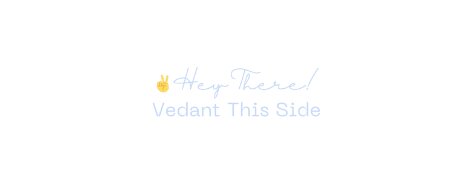
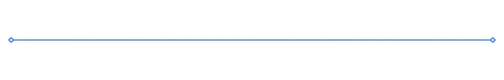

I am an Android Developer.  
I am true engineer head but keeping hobbies is not a bad thing right? So, yeah, I write, dance, play basketball, draw too and when I am not busy being ordinary, I read, explore & learn new technologies.

 

## 👨‍💻 Languages & Tools

 

 
 

|                                                                                                             Statistics                                                                                                             |                                                                                                               Top Languages                                                                                                               |
| :--------------------------------------------------------------------------------------------------------------------------------------------------------------------------------------------------------------------------------: | :---------------------------------------------------------------------------------------------------------------------------------------------------------------------------------------------------------------------------------------: |
| | |

 

## Socials

 

https://github.com/thevedantchourey/thevedantchourey/blob/be401691ae577407d1dff9e82b09f63275bca6df/.media/featProject.mp4
